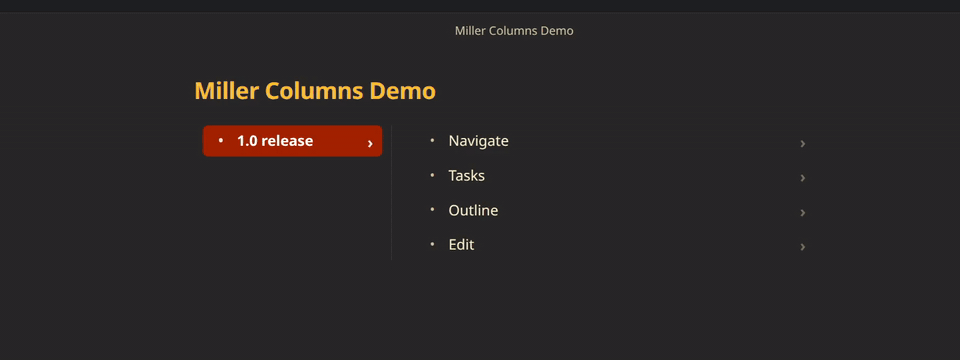

# Miller Columns for Obsidian

Turns a nested markdown list into Finder-style Miller columns: one column per depth, so you can walk a tree without scrolling a long outline.



## Use

Add `#miller-view` anywhere in a `-` list (task items, plain bullets, or both). In reading view or live preview, that list becomes columns.

```markdown
- Project #miller-view
    - Design
        - Wireframes
        - Tokens
    - Build
        - Parser
        - Renderer
```

Click a row to open its children in the next column. The last column grows and wraps as a reading pane; parent columns stay compact. Nodes with children show a chevron.

Checkboxes write back to the note. There is no in-place rename yet — edit the line in source.

**Settings → Miller Columns (Horizontal Tree)** has two options: vim `hjkl` (on by default; arrows always work) and show chevrons on items with children.

## Keyboard

Hover the panel, click it, or Tab into it. Keys do nothing until the panel is active. Escape or a click outside releases it.

| Key | Action |
| --- | --- |
| `↑` `↓` / `k` `j` | Previous / next sibling |
| `←` `→` / `h` `l` | Parent / first child |
| `Space` | Toggle the focused checkbox |
| `Enter` | Insert a sibling after the focused item |
| `Shift`+`Enter` | Insert a child (creates a new column on a leaf) |
| `Alt`+`Enter` or `Ctrl`+`Enter` | Flip task ↔ plain bullet |
| `x`, `Delete`, or `Ctrl`/`Cmd`+`Backspace` | Delete the focused item and its subtree |
| `Escape` | Leave the panel |

New items match the focused row’s kind (task or plain) and its indent (spaces or tabs).

## Limits

- Only `-` lists. `*` bullets and numbered lists stay as normal markdown.
- Rename in the source note. Insert, delete, toggle, and kind flip work in the columns.
- In edit/source mode, insert rewrites the file as one editor change; undo after insert is coarser than after a checkbox toggle or delete.
- Works in reading view and live preview. Source view is the underlying list.

## Install

Until it is in the community plugin directory, copy these three files into:

`Vault/.obsidian/plugins/miller-columns/`

- `main.js`
- `manifest.json`
- `styles.css`

Enable **Miller Columns (Horizontal Tree)** under **Settings → Community plugins**. After a manual copy or a BRAT install, reload the app if the plugin does not appear in that list (Command palette → **Reload app without saving**). Then reopen the note or switch to reading view so `#miller-view` is processed.

## Develop

```bash
npm install
npm run dev      # watch build
npm run build    # type-check + production bundle
npm run test     # Vitest
npm run lint
```

`npm run deploy:vault` builds, then copies the three release files into the configured Syncthing vault plugin folder.

## License

MIT — Copyright (c) 2026 marc-hg
